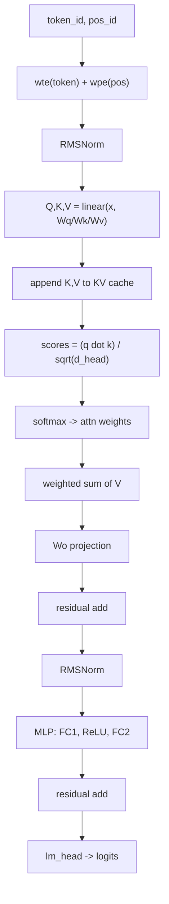

# Anatomy of microgpt

**A start‑to‑finish dissection of a dependency‑free GPT training script (dataset → tokenizer → autograd → Transformer → Adam → sampling)**

This article is a code‑accurate, start‑to‑finish walkthrough of Andrej Karpathy’s *microgpt*: a single, dependency‑free Python file that trains and samples from a GPT‑like language model.

Karpathy’s stated thesis is explicit: the file contains the full **algorithmic content** of what is needed (dataset of documents, tokenizer, autograd engine, GPT‑2‑like architecture, Adam optimizer, training loop, inference loop), while everything else is “just efficiency” (vectorization, GPU kernels, batching, distributed training, etc.).[^karpathy-microgpt]

> **Reading strategy.** We will track each block through three lenses:  
> **(i) objective** (what the block must accomplish), **(ii) mathematics** (minimal equations), **(iii) code** (line‑range pointers).  
> A complete **line‑by‑line appendix (L001–L200)** is assumed available alongside this post.

---

## Contents

1. File overview and reading map  
2. Dataset: documents as a training stream  
3. Tokenizer: character vocab + BOS delimiter  
4. Autograd: scalar reverse‑mode differentiation (`Value`)  
5. Parameters: `state_dict`, initialization, and the 4,192‑parameter count  
6. Core operators: `linear`, `softmax`, `rmsnorm`  
7. The Transformer: GPT decoder block inside `gpt()`  
8. Training: next‑token loss → backprop → Adam update  
9. Inference: temperature sampling and stopping  
10. Efficiency vs algorithm: what changes at scale  
11. microgpt vs standard GPT‑2: requested comparison + key extras  
12. A rigorous validation checklist (what was verified and why it is correct)  
13. Suggested modifications (minimal changes with maximal educational value)  

---

## 1) File overview and reading map

### 1.1 Code map (what lives where)

| Region | Line range | Artifact produced |
|---|---:|---|
| Dataset load | L014–L021 | `docs: list[str]` |
| Tokenizer | L023–L027 | `uchars`, `BOS`, `vocab_size` |
| Autograd | L029–L073 | `Value` + `.backward()` |
| Parameters | L074–L090 | `state_dict`, `params` |
| Model operators | L094–L106 | `linear`, `softmax`, `rmsnorm` |
| Transformer forward | L108–L144 | `gpt()` → `logits` |
| Optimizer + training | L146–L184 | Adam updates + printed loss |
| Inference | L186–L200 | generated samples |

### 1.2 Figure 1 — End‑to‑end pipeline

*(Upload and insert the image `fig1_microgpt_overview.png` here.)*

**Caption.** The script implements the canonical LM training loop: `docs → tokenize → (for each position: logits→softmax→NLL) → backward → Adam update`, followed by an autoregressive sampling loop for inference.[^karpathy-microgpt]

---

## 2) Dataset: `docs` as a document stream

### 2.1 Objective

A GPT does not require “sentences” or “labels.” It requires a **stream of tokens**, optionally partitioned into **documents**. microgpt uses ~32k names (one per line) as documents.[^karpathy-microgpt]

### 2.2 Code mechanics

- If `input.txt` is absent, it is downloaded from Karpathy’s `makemore` names dataset.
- Each non‑empty line becomes one document in `docs: list[str]`.
- `random.shuffle(docs)` is applied once at startup.

**Code pointers:** L014–L021.

### 2.3 Why shuffling matters

This script performs **one‑document SGD steps** (batch size 1 document). If the corpus ordering is structured (alphabetical blocks), the early optimization trajectory can be biased. Shuffling is a minimal safeguard.

---

## 3) Tokenizer: character vocabulary + BOS delimiter

### 3.1 Objective

Neural networks operate on numbers. We need a reversible mapping between text and discrete token IDs.

Production GPTs use subword tokenizers (BPE variants) for efficiency, but microgpt uses the simplest possible tokenizer: **one token per unique character** + one delimiter token (BOS).[^karpathy-microgpt]

### 3.2 Implementation details

- `uchars = sorted(set(''.join(docs)))` builds the vocabulary of unique characters.
- `BOS = len(uchars)` defines a “beginning of sequence” token ID as the next integer.
- `vocab_size = len(uchars) + 1`.

**Code pointers:** L023–L027.

### 3.3 Boundary semantics: BOS as both BOS and EOS

During training, each document is wrapped as:

\[
[BOS, c_1, c_2, ..., c_T, BOS]
\]

The first BOS means “start a new document.” The last BOS acts as an end delimiter (EOS). During generation, sampling BOS triggers stop. This “single delimiter for both ends” is a standard minimal trick in character‑level demos. Notably, GPT‑2 is often configured with the same token id for both BOS and EOS, so microgpt’s single‑delimiter choice has precedent.[^karpathy-microgpt][^hf-gpt2-docs]

---

## 4) Autograd: scalar reverse‑mode differentiation (`Value`)

This is the most conceptually dense block, because it implements backpropagation from first principles.

### 4.1 Objective

Training requires gradients:

\[
\frac{\partial \mathcal{L}}{\partial \theta_i}
\]

for every parameter \(\theta_i\). The script must compute these gradients automatically for an arbitrary computation graph.

### 4.2 Representation: the `Value` node

Each `Value` stores:

- `data`: forward scalar
- `grad`: accumulated gradient dLoss/dThis
- `_children`: pointers to inputs
- `_local_grads`: local partial derivatives (for chain rule)

**Code pointers:** L029–L058.

### 4.3 The invariant implemented by `backward()`

If a node \(v\) depends on a child \(c\), and we already know \(\partial L/\partial v\), then:

\[
\frac{\partial L}{\partial c} \mathrel{+}= \frac{\partial v}{\partial c}\cdot\frac{\partial L}{\partial v}
\]

The `+=` is crucial: when graphs branch (a value reused in multiple places), gradients must **accumulate** across all paths.[^karpathy-microgpt]

**Code pointers:** L059–L072.

### 4.4 Why topological order is used

`backward()` builds a reverse topological ordering by DFS postorder, then traverses it backwards to propagate gradients. This is a standard reverse‑mode autodiff pattern.

---

## 5) Parameters: initialization, shapes, and the 4,192‑parameter count

### 5.1 Objective

Parameters are the model’s “knowledge”: a collection of scalars updated to reduce loss. microgpt organizes parameters as named matrices in `state_dict` (PyTorch terminology), but each “matrix” is a nested Python list of `Value` scalars.

### 5.2 Hyperparameters and their roles

- `n_embd = 16`: residual stream width
- `n_head = 4`, so `head_dim = 4` (must divide `n_embd`)
- `n_layer = 1`: number of Transformer blocks
- `block_size = 16`: maximum context length; also the size of the learned position embedding table

**Code pointers:** L074–L079.

### 5.3 Weight initialization

`matrix(nout, nin, std=0.08)` initializes each scalar weight as a Gaussian `N(0, std)` wrapped as `Value`. This is a deliberately simple initialization; production systems typically use more carefully scaled initializations, but the conceptual role is the same.

**Code pointers:** L080.

### 5.4 Parameter matrices created

- Token embeddings: `wte` (vocab_size × n_embd)
- Position embeddings: `wpe` (block_size × n_embd)
- Per‑layer attention: Wq, Wk, Wv, Wo (each n_embd × n_embd)
- Per‑layer MLP: FC1 (4n_embd × n_embd), FC2 (n_embd × 4n_embd)
- Output head: `lm_head` (vocab_size × n_embd)

**Code pointers:** L081–L088.

### 5.5 Sanity check: the 4,192‑parameter count

With `vocab_size=27`, `n_embd=16`, `block_size=16`, and one layer:

- `wte`: 27×16 = 432
- `wpe`: 16×16 = 256
- `lm_head`: 27×16 = 432
- attention weights: 4×(16×16) = 1024
- MLP weights: (64×16) + (16×64) = 1024 + 1024 = 2048

Total: 432 + 256 + 432 + 1024 + 2048 = **4192**, matching the script’s printout.

---

## 6) Core operators: `linear`, `softmax`, `rmsnorm`

These define the minimal “tensor algebra” microgpt needs, rewritten as scalar Python operations.

### 6.1 `linear(x, W)` — matrix‑vector multiply

\[
y = Wx
\]

No bias term is included (a deliberate simplification).

**Code pointers:** L094–L095.

### 6.2 `softmax(logits)` — stable probability simplex projection

\[
p_i = \frac{e^{z_i}}{\sum_j e^{z_j}}
\]

The code subtracts `max(logits)` for numerical stability. This does not change the result because softmax is shift‑invariant.[^karpathy-microgpt]

**Implementation subtlety (detached max).** `max_val` is computed via `.data`, i.e., without autograd. This avoids defining gradients through `max`. Because softmax is invariant to a constant shift, using a detached constant produces the same output and (almost everywhere) the same gradient.

**Code pointers:** L097–L101.

### 6.3 `rmsnorm(x)` — normalization without learnable affine

\[
x \leftarrow \frac{x}{\sqrt{\mathrm{mean}(x^2)+\epsilon}}
\]

This resembles RMSNorm but **omits** the learned scale parameter frequently used in RMSNorm implementations.[^rmsnorm]

**Code pointers:** L103–L106.

---

## 7) The Transformer: where the GPT “lives”

### 7.1 One‑sentence answer

The GPT‑like decoder Transformer is implemented inside `gpt()`, specifically the loop:

`for li in range(n_layer):`  

**Code pointers:** L114–L141 (overall `gpt()` is L108–L144).

### 7.2 Figure 2 — Transformer block ↔ code mapping

*(Upload and insert `fig2_transformer_block_mapping.png` here.)*

**Caption.** A single layer consists of (1) RMSNorm → QKV projections → multi‑head causal self‑attention → Wo → residual, and (2) RMSNorm → MLP (expand→ReLU→project) → residual.

### 7.3 Variable shapes (single position)

| Symbol / variable | Shape | Where |
|---|---:|---|
| `tok_emb`, `pos_emb`, `x` | `n_embd` | L109–L112 |
| `q`, `k`, `v` | `n_embd` | L118–L120 |
| `keys[li]`, `values[li]` | list of length `t+1`, each entry is `n_embd` | L121–L122 |
| per‑head slices `q_h`, `k_h[t]`, `v_h[t]` | `head_dim` | L125–L128 |
| `attn_logits` | length `t+1` | L129 |
| `attn_weights` | length `t+1` | L130 |
| `head_out` | `head_dim` | L131 |
| concatenated `x_attn` | `n_embd` | L123, L132 |
| output `logits` | `vocab_size` | L143 |

This “shape table” is the fastest way to debug attention implementations: if any length does not match, the entire block collapses.

### 7.4 Attention sublayer: scaled dot‑product + softmax + value aggregation

For each head at time \(t\):

\[
s_{t,i} = \frac{q_t\cdot k_i}{\sqrt{d_{head}}},\quad
\alpha_{t,i} = \mathrm{softmax}_i(s_{t,i}),\quad
h_t = \sum_i \alpha_{t,i} v_i
\]

This is the canonical decoder self‑attention mechanism described in the original Transformer.[^transformer]

**Code pointers:** L115–L134.

### 7.5 Figure 3 — causal masking vs sequential KV cache (same constraint)

*(Upload and insert `fig3_causal_mask_vs_kv_cache.png` here.)*

**Caption.** In vectorized implementations, a triangular causal mask blocks access to future tokens in a full \(T\times T\) attention score matrix. In microgpt, the same causality is enforced structurally because the KV cache only contains past positions. The Transformer paper explicitly describes masking “subsequent positions” in decoder self‑attention.[^transformer]

### 7.6 MLP sublayer: 4× expansion, ReLU, projection back

\[
\mathrm{MLP}(x) = W_2\,\mathrm{ReLU}(W_1 x)
\]

The MLP performs local computation per position (no cross‑token interaction). Attention is the token‑communication channel; MLP is the token‑local compute channel. This “communication ↔ computation” decomposition is a useful mental model when reading Transformer code.

**Code pointers:** L135–L141.

### 7.7 Pre‑norm placement and residual stream

Both sublayers are pre‑normalized (RMSNorm before attention; RMSNorm before MLP). GPT‑2 explicitly reports a pre‑norm shift (“Layer normalization … moved to the input of each sub-block”).[^gpt2]

Residual additions:

- after attention: L134
- after MLP: L141

### 7.8 Important divergence from GPT‑2: final normalization

GPT‑2 additionally reports an extra LayerNorm after the final block (often called `ln_f` in reference implementations).[^gpt2][^hf-gpt2-code]  
This microgpt script does **not** include an explicit final normalization module before projecting to logits (L143), which is a real architectural simplification.

---

## 8) Training: next‑token loss → backprop → Adam update

### 8.1 Objective

At each position \(t\), predict the next token \(x_{t+1}\) given past tokens \(x_{\le t}\), minimizing negative log‑likelihood:

\[
\mathcal{L}_t = -\log p_\theta(x_{t+1} \mid x_{\le t})
\]

### 8.2 Document selection and truncation

- `doc = docs[step % len(docs)]` (cycling through the shuffled dataset)
- `tokens = [BOS] + chars + [BOS]`
- `n = min(block_size, len(tokens) - 1)` ensures `pos_id < block_size` (so `wpe[pos_id]` is safe)

**Code pointers:** L155–L158.

### 8.3 Forward unroll: explicit KV cache construction during training

For each position:

- call `gpt()` with current token, position, and the growing cache
- compute `softmax(logits)`
- accumulate `loss_t = -log p(target)`

Average across positions:

- `loss = (1 / n) * sum(losses)`

**Code pointers:** L160–L169.

### 8.4 Backpropagation

`loss.backward()` computes gradients for every parameter used in the forward pass. Because the KV cache stores live `Value` nodes, gradients propagate through cache edges across time positions (i.e., backprop across the unrolled attention computation). Karpathy calls out this “KV cache during training” perspective explicitly.[^karpathy-microgpt]

**Code pointers:** L171–L172.

### 8.5 Adam update + bias correction

microgpt implements Adam with first/second moment buffers and bias correction as in the original paper.[^adam]

It also uses a linear learning‑rate decay: `lr_t = lr * (1 - step/num_steps)`.

**Code pointers:** L174–L182.

### 8.6 Loss scale sanity check

Uniform random guessing over \(V\) tokens gives expected loss \(\log V\). With \(V=27\), \(\log 27 \approx 3.296\). Karpathy uses this to interpret the early loss values (~3.3) in his write‑up.[^karpathy-microgpt]

---

## 9) Inference: temperature sampling and termination

Sampling loop:

1. Start with BOS.
2. Repeatedly:
   - compute logits
   - divide logits by `temperature`
   - softmax to probabilities
   - sample next token
3. Stop on BOS or when reaching `block_size`.

**Code pointers:** L186–L200.

---

## 10) Efficiency vs algorithm: what changes at scale

microgpt is algorithmically faithful but computationally inefficient:

- Scalar computation graphs instead of tensor kernels
- Python loops over positions/heads/cache length/embedding dims
- Attention is \(O(T^2 D)\) per layer; constants are large

Karpathy frames this explicitly as the point: the script is a microscope for the algorithm, not a production engine.[^karpathy-microgpt]

---

## 11) microgpt vs standard GPT‑2 (requested comparison + key extras)

### 11.1 The requested five axes

| Axis | microgpt (this script) | “Standard GPT‑2” (report / common implementations) |
|---|---|---|
| Normalization | RMSNorm‑like (no learned affine), pre‑norm placement | LayerNorm moved to sub‑block input; GPT‑2 adds an additional final norm[^gpt2][^hf-gpt2-code] |
| Activation | ReLU | GELU‑family typical in GPT‑2 implementations[^hf-gpt2-docs] |
| Positional encoding | learned absolute `wpe[pos]` | GPT‑2 reference implementations use learned absolute position embeddings (`wpe`).[^hf-gpt2-code] |
| Weight tying | `wte` and `lm_head` are separate matrices | GPT‑2 LM head weights are typically tied to input embeddings.[^hf-gpt2-code][^hf-gpt2-docs] |
| Causal masking | no explicit mask; causality via sequential KV cache | triangular causal mask in vectorized attention; decoder masking described in Transformer.[^transformer][^hf-gpt2-code] |

### 11.2 Additional differences that materially matter

- **Bias terms.** microgpt uses no biases; GPT‑2 reference implementations use bias parameters in their linear layers (e.g., `Conv1D` defines an explicit bias term).[^karpathy-microgpt][^hf-conv1d][^hf-gpt2-code]
- **Final norm.** GPT‑2 explicitly adds a final LayerNorm (often `ln_f`); microgpt omits an explicit final norm.[^gpt2][^hf-gpt2-code]
- **Dropout and regularization.** microgpt has no dropout; GPT‑2 reference implementations include dropout in embeddings, attention, and residual streams.[^hf-gpt2-code]
- **Weight tying.** microgpt does not tie embeddings and output head; GPT‑2 commonly does.[^hf-gpt2-code][^hf-gpt2-docs]

---

## 12) Validation checklist (what was verified)

This section is included to minimize the risk of “tutorial drift” (where commentary deviates from code).

1. **Transformer location.** Verified that attention+MLP+residual logic exists only inside `gpt()` and the `for li in range(n_layer)` loop (L114–L141).  
2. **Causality.** Verified that attention only iterates over cached keys/values (L121–L122, L129), so future tokens are structurally inaccessible.  
3. **Parameter count (4,192).** Recomputed from shapes and matched to runtime printout (L090).  
4. **Baseline loss scale.** Verified that uniform cross‑entropy over 27 tokens is \(\log 27\approx 3.296\), consistent with Karpathy’s reported early losses.  
5. **Pre‑norm claim.** Verified RMSNorm occurs before attention and before MLP (L117, L137); GPT‑2 report states LayerNorm moved to sub‑block input.[^gpt2]  
6. **Final norm difference.** Verified microgpt has no final norm before `lm_head` (L143), while GPT‑2 adds a final norm (`ln_f`) in common reference implementations and also reports an additional final norm.[^gpt2][^hf-gpt2-code]  
7. **Softmax stability.** Verified the implementation subtracts the maximum logit (L098–L101).  
8. **Mask equivalence claim.** Verified Transformer decoder masking “prevents attending to subsequent positions” in the original paper, and verified a triangular causal mask in a standard GPT‑2 reference implementation.[^transformer][^hf-gpt2-code]  

---

## 13) Suggested modifications (small edits, clear conceptual payoff)

1. **Add a final norm (`ln_f` / `rms_f`) before `lm_head`.**  
   Tests whether final normalization stabilizes training and improves sampling.

2. **Tie weights (`lm_head` ↔ `wte`).**  
   Aligns with common GPT‑2 setups and reduces parameter count.[^hf-gpt2-code][^hf-gpt2-docs]

3. **Add dict‑based token lookup (`stoi` / `itos`).**  
   Replaces repeated `uchars.index(ch)` (which is linear in vocabulary size) with O(1) mapping—an “efficiency only” change.

4. **Replace ReLU with GELU.**  
   Brings activation closer to GPT‑2; isolate the activation’s effect.

5. **Vectorize one component (e.g., attention logits) with Python lists → matrix form.**  
   Demonstrates how “efficiency engineering” begins without changing the algorithm.

---

## Optional: Mermaid diagram (GitHub‑safe)

---

## Footnotes / References

[^karpathy-microgpt]: Andrej Karpathy (2026). *microgpt* (blog post + links to source). https://karpathy.github.io/2026/02/12/microgpt/  
[^karpathy-source]: Andrej Karpathy (2026). *microgpt.py* (Gist). https://gist.github.com/karpathy/8627fe009c40f57531cb18360106ce95  
[^gpt2]: Radford et al. (2019). *Language Models are Unsupervised Multitask Learners* (GPT‑2 report). https://cdn.openai.com/better-language-models/language_models_are_unsupervised_multitask_learners.pdf  
[^transformer]: Vaswani et al. (2017). *Attention Is All You Need* (decoder masking). https://papers.neurips.cc/paper/7181-attention-is-all-you-need.pdf  
[^adam]: Kingma & Ba (2014). *Adam: A Method for Stochastic Optimization*. https://arxiv.org/abs/1412.6980  
[^rmsnorm]: Zhang & Sennrich (2019). *Root Mean Square Layer Normalization*. https://arxiv.org/abs/1910.07467  
[^hf-gpt2-docs]: Hugging Face Transformers docs: GPT‑2 (activation config; BOS/EOS IDs; weight‑tying configuration). https://huggingface.co/docs/transformers/en/model_doc/gpt2  
[^hf-gpt2-code]: Hugging Face Transformers source view: `modeling_gpt2.py` (final `ln_f`, learned `wpe`, dropout, causal mask buffer, and weight‑tying note in docstring). https://huggingface.co/transformers/v4.9.2/_modules/transformers/models/gpt2/modeling_gpt2.html  
[^hf-conv1d]: Hugging Face Transformers raw source: `Conv1D` definition with an explicit `bias` parameter. https://raw.githubusercontent.com/huggingface/transformers/main/src/transformers/pytorch_utils.py  
