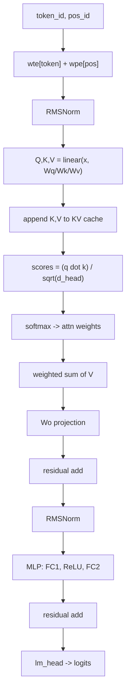

# Anatomy of microgpt

**A start-to-finish, code-faithful dissection of a dependency-free GPT training script (dataset → tokenizer → autograd → Transformer → Adam → sampling)**

This article is a *standalone* technical walkthrough of Andrej Karpathy’s **microgpt**: a single, dependency‑free Python file that trains and samples from a GPT‑like language model. Karpathy’s thesis is that the file contains the full **algorithmic content** required for GPT pretraining and inference, while everything else in production systems is primarily about **efficiency** (vectorization, GPU kernels, batching, distributed training, memory management, etc.).[^karpathy-microgpt]

> **How this post is organized.** Each component is explained through three lenses:  
> **(1) Objective** (what it must do), **(2) Mathematics** (minimal equations), **(3) Code** (a self-contained excerpt).  
> **No line-number appendix is required to follow the main text.** An optional line-numbered listing is provided as an appendix.

---

## Reader guidance (to reduce friction)

### Two reading modes

- **Mode A — Concept-first (recommended on first pass):** read the figures + “Objective/Mathematics” subsections; skim the code blocks.
- **Mode B — Implementation-first:** read the code blocks in order; use the “Mathematics” subsections only as a cross-check.

### Prerequisites (minimal)

- Comfortable with Python control flow (functions, lists, loops).
- Familiarity with *vectors as lists of numbers*.
- Optional but helpful: chain rule intuition, dot products, and log/exp.

### Mini glossary (you will see these repeatedly)

- **Token**: an integer symbol. Here: one character = one token.  
- **BOS**: “beginning of sequence” delimiter token; used here for *both* document start and end.
- **Logits**: unnormalized scores over next tokens.
- **Softmax**: maps logits to probabilities.
- **NLL / cross-entropy**: \(-\log p(\text{target})\).
- **KV cache**: stored keys/values from past positions used by attention.
- **Residual stream**: the running hidden state updated by attention and MLP blocks.

---


## Optional: a 5-minute math micro‑primer (for first-time readers)

This section is intentionally terse. It exists to reduce the prerequisite burden without diluting the main analysis.

### Vectors and dot products
A vector here is just a Python list of scalars. The **dot product** is:

\[
a \cdot b = \sum_i a_i b_i
\]

This appears inside attention scores.

### Softmax and log-likelihood
Given logits \(z \in \mathbb{R}^V\), softmax defines probabilities:

\[
p_i = \frac{e^{z_i}}{\sum_j e^{z_j}}
\]

Next-token training uses **negative log-likelihood (NLL)**:

\[
\mathcal{L} = -\log p(\text{target})
\]

If the model assigns probability 1.0 to the correct token, the loss is 0. If the probability is near 0, the loss becomes large.

### Chain rule (the one rule autograd needs)
If \(u\) depends on \(v\), and the loss \(\mathcal{L}\) depends on \(u\), then:

\[
\frac{\partial \mathcal{L}}{\partial v} = \frac{\partial u}{\partial v}\cdot\frac{\partial \mathcal{L}}{\partial u}
\]

Reverse-mode autodiff applies this repeatedly from the loss back to parameters.

---

## Contents

1. What microgpt implements (and what it intentionally omits)  
2. Dataset: documents as a training stream  
3. Tokenizer: character vocabulary + BOS boundary token  
4. Autograd: scalar reverse-mode differentiation (`Value`)  
5. Parameters: `state_dict`, shapes, and the parameter-count sanity check  
6. Core operators: `linear`, `softmax`, `rmsnorm`  
7. The Transformer: GPT decoder block inside `gpt()`  
8. Training: next-token loss → backprop → Adam update  
9. Inference: temperature sampling and stopping criterion  
10. microgpt vs “standard GPT‑2”: requested comparison + key extras  
11. Validation against canonical references (Transformer / GPT‑2 / Adam / RMSNorm)  
12. Appendix: full line-numbered script + line-by-line notes (optional)

---

## 1) What microgpt implements (and what it intentionally omits)

> **Figure 1 (insert): End-to-end pipeline.** Use `fig1_microgpt_overview.png`.
>
> **Caption.** `docs → tokenize → (for each position: logits→softmax→NLL) → backward → Adam update`, then autoregressive sampling at inference.

### Quick run (what you should see)

If you run the script with stock settings, you should see:

- a dataset size around **32k** documents (names),
- a vocabulary size around **27** (a–z plus BOS),
- a parameter count of **4,192**,
- training loss starting near \(\log 27 \approx 3.296\) and decreasing over steps.

This is a simple but effective end-to-end sanity check before reading the details.

### Objective

Establish what the script contains “algorithmically,” and what is left out as “engineering.”

Karpathy enumerates microgpt as a complete algorithmic loop: **dataset of documents, tokenizer, autograd engine, GPT‑2‑like neural architecture, Adam optimizer, training loop, inference loop**.[^karpathy-microgpt]

### What is included

- A document dataset `docs: list[str]` (names, one per line)
- A character-level tokenizer + BOS delimiter
- A scalar autograd engine (`Value`) implementing reverse-mode differentiation
- A decoder-only Transformer (GPT-like) with:
  - learned token/position embeddings
  - multi-head causal self-attention
  - MLP (feed-forward) blocks
  - residual connections
  - RMSNorm-like normalization
- Adam optimizer (with bias correction)
- A next-token negative log-likelihood loss
- An autoregressive sampling loop (temperature-controlled)

### What is omitted (deliberately)

microgpt is intentionally *not* a scalable training system. It omits or simplifies:

- tensorized computation (everything is scalar `Value` objects)
- GPU execution and optimized kernels
- batching / parallel time-steps
- dropout and many stability tricks
- modern architectural variants (RoPE, gated MLPs, GQA, MoE, etc.)
- large-scale data processing, mixing, deduplication

This is not a flaw; it is the educational design.

---

## 2) Dataset: `docs` as a document stream

### Objective

Provide a stream of discrete training sequences. In production this might be web pages; in microgpt it is a simple set of names.[^karpathy-microgpt]

### Code (self-contained excerpt)

```python
import os, random, urllib.request
random.seed(42)

if not os.path.exists("input.txt"):
    names_url = "https://raw.githubusercontent.com/karpathy/makemore/refs/heads/master/names.txt"
    urllib.request.urlretrieve(names_url, "input.txt")

docs = [l.strip() for l in open("input.txt").read().split("\n") if l.strip()]
random.shuffle(docs)
print("num docs:", len(docs))
```

### Notes

- `docs` is a list of documents, not one giant concatenated stream. This matters because microgpt uses BOS to mark boundaries.
- `random.shuffle(docs)` reduces order effects when doing one-document SGD.

---

## 3) Tokenizer: character vocabulary + BOS boundary token

### Objective

Map text ↔ integers (tokens). microgpt uses the simplest tokenizer: **one character per token** plus one delimiter token BOS.[^karpathy-microgpt]

### Mathematics (minimal)

Tokenizer defines two maps:

- `stoi: char → id`
- `itos: id → char`

### Code (self-contained excerpt)

```python
uchars = sorted(set("".join(docs)))   # unique characters
BOS = len(uchars)                    # delimiter token id
vocab_size = len(uchars) + 1
print("vocab size:", vocab_size)
```

### Boundary semantics: BOS as both “start” and “end”

Training wraps each document:

\[
[BOS, c_1, c_2, \dots, c_T, BOS]
\]


### Worked example: a document becomes training pairs

Take the name `"emma"`. With the BOS delimiter, the training sequence is:

\[
[BOS, e, m, m, a, BOS]
\]

At each position \(t\), the input is the current token and the target is the next token. For example:

- input `BOS` → target `e`
- input `e`   → target `m`
- input `m`   → target `m`
- input `m`   → target `a`
- input `a`   → target `BOS`

This is the entire learning objective: **predict the next token given the prefix**.


---

## 4) Autograd: scalar reverse-mode differentiation (`Value`)

This is the most conceptually dense component, because it implements backpropagation from first principles.

### Objective

Given a scalar loss \(\mathcal{L}\) computed from many intermediate values and parameters, compute:

\[
\frac{\partial \mathcal{L}}{\partial \theta_i}
\]

for every parameter \(\theta_i\).

### Mathematics (minimal)

If a node \(v\) depends on a child \(c\), then reverse-mode autodiff applies:

\[
\frac{\partial \mathcal{L}}{\partial c} \mathrel{+}= \frac{\partial v}{\partial c}\cdot\frac{\partial \mathcal{L}}{\partial v}
\]

The **accumulation** (`+=`) matters when computation graphs branch.

### Code (self-contained excerpt: core of `Value`)

```python
import math

class Value:
    __slots__ = ("data", "grad", "_children", "_local_grads")

    def __init__(self, data, children=(), local_grads=()):
        self.data = data
        self.grad = 0.0
        self._children = children
        self._local_grads = local_grads

    def __add__(self, other):
        other = other if isinstance(other, Value) else Value(other)
        return Value(self.data + other.data, (self, other), (1.0, 1.0))

    def __mul__(self, other):
        other = other if isinstance(other, Value) else Value(other)
        return Value(self.data * other.data, (self, other), (other.data, self.data))

    def log(self): return Value(math.log(self.data), (self,), (1.0 / self.data,))
    def exp(self): return Value(math.exp(self.data), (self,), (math.exp(self.data),))

    def relu(self):
        return Value(max(0.0, self.data), (self,), (1.0 if self.data > 0 else 0.0,))

    def backward(self):
        topo, visited = [], set()

        def build(v):
            if v not in visited:
                visited.add(v)
                for ch in v._children:
                    build(ch)
                topo.append(v)

        build(self)
        self.grad = 1.0  # dL/dL = 1

        for v in reversed(topo):
            for ch, lg in zip(v._children, v._local_grads):
                ch.grad += lg * v.grad
```

### Worked example: gradient accumulation when graphs branch

A classic sanity check is a graph where a variable is used twice:

```python
a = Value(2.0)
b = Value(3.0)
c = a * b      # c = 6
L = c + a      # L = 8  (a contributes via two paths)
L.backward()
print(a.grad)  # 4  (= b + 1)
print(b.grad)  # 2  (= a)
```

The key point is `a.grad = b + 1` because \(L = a b + a\) uses \(a\) in two places, so gradients **sum across paths**.

### Notes

- This is the same *algorithmic* mechanism as PyTorch autograd (reverse-mode), but applied to scalars rather than tensors.[^karpathy-microgpt]
- Topological ordering ensures every node’s gradient is computed after gradients of nodes that depend on it.

---

## 5) Parameters: `state_dict`, shapes, and a sanity check

### Objective

Initialize all learnable parameters (weights) as `Value` scalars, and organize them by name.

### Code (self-contained excerpt)

```python
import random

n_embd = 16
n_head = 4
n_layer = 1
block_size = 16
head_dim = n_embd // n_head

def matrix(nout, nin, std=0.08):
    return [[Value(random.gauss(0, std)) for _ in range(nin)] for _ in range(nout)]

state_dict = {
    "wte": matrix(vocab_size, n_embd),
    "wpe": matrix(block_size, n_embd),
    "lm_head": matrix(vocab_size, n_embd),
}

for i in range(n_layer):
    state_dict[f"layer{i}.attn_wq"] = matrix(n_embd, n_embd)
    state_dict[f"layer{i}.attn_wk"] = matrix(n_embd, n_embd)
    state_dict[f"layer{i}.attn_wv"] = matrix(n_embd, n_embd)
    state_dict[f"layer{i}.attn_wo"] = matrix(n_embd, n_embd)
    state_dict[f"layer{i}.mlp_fc1"] = matrix(4 * n_embd, n_embd)
    state_dict[f"layer{i}.mlp_fc2"] = matrix(n_embd, 4 * n_embd)

params = [p for mat in state_dict.values() for row in mat for p in row]
print("num params:", len(params))
```

### Sanity check: parameter count = 4,192 (with vocab=27)

With `vocab_size=27`, `n_embd=16`, `block_size=16`, `n_layer=1`:

- `wte`: 27×16 = 432  
- `wpe`: 16×16 = 256  
- `lm_head`: 27×16 = 432  
- attention: 4×(16×16) = 1024  
- MLP: (64×16) + (16×64) = 1024 + 1024 = 2048  

Total = 432 + 256 + 432 + 1024 + 2048 = **4192**.

---

## 6) Core operators: `linear`, `softmax`, `rmsnorm`

### Objective

Implement the minimal numeric building blocks needed for Transformer forward passes, using scalar `Value` operations.

### 6.1 `linear`: matrix-vector multiply (no bias)

\[
y = W x
\]

```python
def linear(x, w):
    return [sum(wi * xi for wi, xi in zip(wo, x)) for wo in w]
```

### 6.2 `softmax`: stable normalization into a probability simplex

\[
p_i = \frac{e^{z_i}}{\sum_j e^{z_j}}
\]

```python
def softmax(logits):
    max_val = max(v.data for v in logits)      # detached constant
    exps = [(v - max_val).exp() for v in logits]
    total = sum(exps)
    return [e / total for e in exps]
```

**Technical note (why detaching max is fine).** Softmax is invariant to adding/subtracting a constant shift. Using a detached `max_val` gives identical probabilities and (almost everywhere) identical gradients, while avoiding defining gradients through `max`.

### 6.3 `rmsnorm`: RMS-based normalization (no learned affine)

\[
x \leftarrow \frac{x}{\sqrt{\mathrm{mean}(x^2)+\epsilon}}
\]

```python
def rmsnorm(x):
    ms = sum(xi * xi for xi in x) / len(x)
    scale = (ms + 1e-5) ** -0.5
    return [xi * scale for xi in x]
```

This resembles RMSNorm but omits the learned gain parameter \(\gamma\) common in many RMSNorm implementations.[^rmsnorm]

---

## 7) The Transformer: where the GPT “lives” (`gpt()`)

> **Figure 2 (insert): Transformer block ↔ code mapping.** Use `fig2_transformer_block_mapping.png`.
>
> **Caption.** One layer = (pre-norm → multi-head causal self-attention → residual) + (pre-norm → MLP/FFN → residual).

> **Figure 3 (insert): Causal mask vs sequential KV cache.** Use `fig3_causal_mask_vs_kv_cache.png`.
>
> **Caption.** Vectorized GPTs enforce causality with a triangular attention mask. microgpt enforces the same constraint by only caching past keys/values.

### Objective

Given the current token ID and position ID, plus cached keys/values from earlier positions, output logits over the next token.

microgpt follows a GPT‑2-like decoder-only Transformer but simplifies normalization and activations (RMSNorm instead of LayerNorm; ReLU instead of GeLU; no biases).[^karpathy-microgpt]

### Canonical reference

Decoder self-attention must prevent attending to future positions (“subsequent positions”). The Transformer paper describes this explicitly as masking in the decoder self-attention sublayer.[^transformer]

### Code (self-contained excerpt: the full `gpt()`)

```python
def gpt(token_id, pos_id, keys, values):
    # embeddings
    tok_emb = state_dict["wte"][token_id]
    pos_emb = state_dict["wpe"][pos_id]
    x = [t + p for t, p in zip(tok_emb, pos_emb)]
    x = rmsnorm(x)

    for li in range(n_layer):
        # (1) Multi-head self-attention
        x_residual = x
        x = rmsnorm(x)

        q = linear(x, state_dict[f"layer{li}.attn_wq"])
        k = linear(x, state_dict[f"layer{li}.attn_wk"])
        v = linear(x, state_dict[f"layer{li}.attn_wv"])

        keys[li].append(k)
        values[li].append(v)

        x_attn = []
        for h in range(n_head):
            hs = h * head_dim
            q_h = q[hs:hs + head_dim]
            k_h = [ki[hs:hs + head_dim] for ki in keys[li]]
            v_h = [vi[hs:hs + head_dim] for vi in values[li]]

            attn_logits = [
                sum(q_h[j] * k_h[t][j] for j in range(head_dim)) / (head_dim ** 0.5)
                for t in range(len(k_h))
            ]
            attn_weights = softmax(attn_logits)

            head_out = [
                sum(attn_weights[t] * v_h[t][j] for t in range(len(v_h)))
                for j in range(head_dim)
            ]
            x_attn.extend(head_out)

        x = linear(x_attn, state_dict[f"layer{li}.attn_wo"])
        x = [a + b for a, b in zip(x, x_residual)]

        # (2) MLP / FFN
        x_residual = x
        x = rmsnorm(x)
        x = linear(x, state_dict[f"layer{li}.mlp_fc1"])
        x = [xi.relu() for xi in x]
        x = linear(x, state_dict[f"layer{li}.mlp_fc2"])
        x = [a + b for a, b in zip(x, x_residual)]

    logits = linear(x, state_dict["lm_head"])
    return logits
```

### Why causality holds without an explicit triangular mask

Vectorized GPT implementations compute attention scores for all time steps at once and must apply an explicit triangular mask. microgpt computes one position at a time and appends (K,V) as it goes; therefore at position \(t\), the cache only contains indices \(0..t\). Future tokens are structurally absent.

This is equivalent to the decoder masking constraint described in the Transformer paper, implemented via control flow rather than a matrix mask.[^transformer][^karpathy-microgpt]

### Important divergence from GPT‑2: final normalization

GPT‑2 reports adding an additional LayerNorm after the final self-attention block (often `ln_f` in reference implementations).[^gpt2][^hf-gpt2-code]  
microgpt omits an explicit final normalization before `lm_head`.

---

## 8) Training: next-token loss → backprop → Adam update

### Objective

Minimize next-token negative log-likelihood:

\[
\mathcal{L}_t = -\log p_\theta(x_{t+1} \mid x_{\le t})
\]

### Code (self-contained excerpt: training loop core)

```python
learning_rate, beta1, beta2, eps_adam = 0.01, 0.85, 0.99, 1e-8
m = [0.0] * len(params)
v = [0.0] * len(params)

num_steps = 1000
for step in range(num_steps):
    doc = docs[step % len(docs)]
    tokens = [BOS] + [uchars.index(ch) for ch in doc] + [BOS]
    n = min(block_size, len(tokens) - 1)

    keys, values = [[] for _ in range(n_layer)], [[] for _ in range(n_layer)]
    losses = []
    for pos_id in range(n):
        token_id, target_id = tokens[pos_id], tokens[pos_id + 1]
        logits = gpt(token_id, pos_id, keys, values)
        probs = softmax(logits)
        losses.append(-probs[target_id].log())

    loss = (1 / n) * sum(losses)
    loss.backward()

    lr_t = learning_rate * (1 - step / num_steps)
    for i, p in enumerate(params):
        m[i] = beta1 * m[i] + (1 - beta1) * p.grad
        v[i] = beta2 * v[i] + (1 - beta2) * (p.grad ** 2)
        m_hat = m[i] / (1 - beta1 ** (step + 1))
        v_hat = v[i] / (1 - beta2 ** (step + 1))
        p.data -= lr_t * m_hat / (v_hat ** 0.5 + eps_adam)
        p.grad = 0.0

    print(f"step {step+1:4d} / {num_steps:4d} | loss {loss.data:.4f}")
```

### Notes

- This is Adam with bias correction, consistent with the original Adam paper.[^adam]
- The initial loss scale sanity check: uniform guessing gives \(\log V\). With \(V=27\), \(\log 27 \approx 3.296\), matching the common “random baseline” intuition used by Karpathy.[^karpathy-microgpt]

---

## 9) Inference: temperature sampling

### Objective

Generate a new “document” by sampling one token at a time from the model’s predicted distribution, stopping at BOS.

### Code (self-contained excerpt)

```python
import random

temperature = 0.5
for sample_idx in range(20):
    keys, values = [[] for _ in range(n_layer)], [[] for _ in range(n_layer)]
    token_id = BOS
    out = []
    for pos_id in range(block_size):
        logits = gpt(token_id, pos_id, keys, values)
        probs = softmax([l / temperature for l in logits])
        token_id = random.choices(range(vocab_size), weights=[p.data for p in probs])[0]
        if token_id == BOS:
            break
        out.append(uchars[token_id])
    print("sample", sample_idx + 1, ":", "".join(out))
```

### Temperature interpretation

Dividing logits by \(T\):

- \(T < 1\): sharpens distribution (lower entropy), more conservative sampling
- \(T \to 0\): approaches greedy decoding
- \(T > 1\): flattens distribution, more diverse but noisier generations

---

## 10) microgpt vs “standard GPT‑2” (requested five axes + key extras)

Below is a focused comparison on the requested axes. For “standard GPT‑2,” the GPT‑2 report and a widely used reference implementation (Hugging Face) are used as anchors.[^gpt2][^hf-gpt2-docs][^hf-gpt2-code]

| Axis | microgpt | Standard GPT‑2 (report / common implementations) |
|---|---|---|
| Normalization | RMSNorm-like; no learned affine; pre-norm | LayerNorm moved to sub-block input; additional final norm (`ln_f`) appears in reference implementations[^gpt2][^hf-gpt2-code] |
| Activation | ReLU | GELU-family (e.g., `gelu_new` in GPT‑2 configs)[^hf-gpt2-docs] |
| Positional encoding | learned absolute `wpe[pos]` | learned absolute positional embedding `wpe`[^hf-gpt2-code] |
| Weight tying | no tying (`wte` and `lm_head` separate) | LM head weights typically tied to input embeddings[^hf-gpt2-code] |
| Causal masking | no explicit mask; sequential KV cache enforces causality | triangular causal mask in attention; decoder masking described in Transformer[^transformer][^hf-gpt2-code] |

Additional differences that matter in practice:

- **Bias terms.** microgpt uses no biases; GPT‑2 reference layers commonly include bias parameters.[^hf-conv1d]
- **Dropout.** microgpt has no dropout; GPT‑2 reference implementations include dropout modules.[^hf-gpt2-code]

---

## 11) Validation against canonical references (to reduce “tutorial drift”)

This section addresses a common failure mode: commentary that slowly diverges from the actual code.

### Verified claims (and why they are correct)

1. **Decoder masking requirement (theory):** Transformer decoder self-attention must prevent attending to subsequent positions.[^transformer]  
2. **Causality mechanism (implementation):** microgpt enforces the same constraint structurally by only attending over cached past keys/values.[^karpathy-microgpt]  
3. **GPT‑2 pre‑norm shift + extra final norm:** GPT‑2 report describes moving LayerNorm to sub-block inputs and adding an additional LayerNorm after the final self-attention block.[^gpt2]  
4. **Reference GPT‑2 contains `ln_f`, learned `wpe`, causal mask buffers:** confirmed in HF source view.[^hf-gpt2-code]  
5. **Adam is implemented with first/second moments + bias correction:** consistent with the Adam paper.[^adam]  
6. **RMSNorm definition (conceptual match):** RMSNorm is defined as RMS-based normalization and motivated as dropping re-centering; microgpt’s `rmsnorm` is a simplified variant (no learned gain).[^rmsnorm]

---

## 12) Appendix (optional): full script + line-numbered notes

If you want the “single-file experience” exactly as Karpathy presents it, see:

- Karpathy’s blog post and links to the full source.[^karpathy-microgpt]
- The companion line-numbered listing and notes shipped with this article (appendix file).

This appendix is optional; the main post includes all critical excerpts needed to follow the algorithm end-to-end.

---

## GitHub-safe Mermaid (optional, for non‑Medium renderers)

Medium does not render Mermaid diagrams, but GitHub does. Use this if you publish a companion README.



---

## References

[^karpathy-microgpt]: Andrej Karpathy (2026). *microgpt* (blog post + links to source). https://karpathy.github.io/2026/02/12/microgpt/  
[^transformer]: Vaswani et al. (2017). *Attention Is All You Need* (decoder masking). https://papers.neurips.cc/paper/7181-attention-is-all-you-need.pdf  
[^gpt2]: Radford et al. (2019). *Language Models are Unsupervised Multitask Learners* (GPT‑2 report). https://cdn.openai.com/better-language-models/language_models_are_unsupervised_multitask_learners.pdf  
[^adam]: Kingma & Ba (2014). *Adam: A Method for Stochastic Optimization*. https://arxiv.org/abs/1412.6980  
[^rmsnorm]: Zhang & Sennrich (2019). *Root Mean Square Layer Normalization*. https://arxiv.org/abs/1910.07467  
[^hf-gpt2-docs]: Hugging Face Transformers docs: GPT‑2. https://huggingface.co/docs/transformers/en/model_doc/gpt2  
[^hf-gpt2-code]: Hugging Face Transformers source view: GPT‑2 model code (`modeling_gpt2.py`). https://huggingface.co/transformers/v4.9.2/_modules/transformers/models/gpt2/modeling_gpt2.html  
[^hf-conv1d]: Hugging Face Transformers `Conv1D` definition (bias parameter). https://raw.githubusercontent.com/huggingface/transformers/main/src/transformers/pytorch_utils.py  
