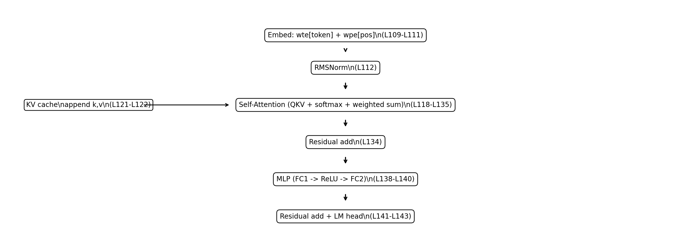

# Reading *microgpt*: The Algorithmic Core of a GPT‑2–Like Decoder Transformer in Pure Python

> **Goal.** Normalize the *minimal algorithmic components* of “training + inference GPT” shown in Andrej Karpathy’s *microgpt* into a single, traceable chain: **concept ↔ equation ↔ code**.  
> **Object of analysis.** The single-file script as provided (Appendix: line numbers **L001–L200**).  
> **Style.** Research-note / lecture-note tone (minimal rhetoric, maximal operational clarity).

---

## 0. One-sentence answer: where is the Transformer?

In this script, the Transformer (more precisely, a **GPT‑2–style decoder-only Transformer**) is implemented inside `gpt()`:

- the loop `for li in range(n_layer):` (**Appendix L114–L142**)  
  - (1) **Multi‑Head Self‑Attention** sublayer + residual  
  - (2) **MLP / FFN** sublayer + residual  

This is structurally isomorphic to the canonical GPT block: alternating **communication (attention)** and **computation (MLP)** on a residual stream.

---

## 1. What *microgpt* is (and why it is useful)

Karpathy introduces *microgpt* as a “single file of pure Python with no dependencies” that **trains and runs (inferences) a GPT**, and he explicitly enumerates the components it contains: dataset of documents, tokenizer, autograd, GPT‑2‑like architecture, Adam, training loop, and inference loop. He also emphasizes the guiding thesis: **“Everything else is just efficiency.”**  
Source: Karpathy, *microgpt* (Feb 12, 2026).  
- https://karpathy.github.io/2026/02/12/microgpt/  
- https://karpathy.ai/microgpt.html  
- https://gist.github.com/karpathy/8627fe009c40f57531cb18360106ce95  

A technical consequence of this “no vectorization” design is that *microgpt* constructs a **KV cache explicitly even during training**, and—because the cached keys/values are live `Value` nodes—**backpropagation flows through the cache** (i.e., not detached).

---

## 2. Code map: sections, roles, and line ranges

| Region | Lines | What it does | Output / artifact |
|---|---:|---|---|
| Dataset load | L014–L021 | Build `docs: list[str]` | document stream |
| Tokenizer | L023–L027 | Character vocab + BOS | `BOS`, `vocab_size` |
| Autograd | L029–L073 | Scalar reverse-mode AD (`Value`) | `.backward()` |
| Parameters | L074–L090 | Initialize embeddings/attn/MLP/head | `state_dict`, `params` |
| Model | L092–L144 | `linear`, `softmax`, `rmsnorm`, `gpt()` | `logits` |
| Optimizer + training | L146–L184 | Adam + LR decay + training loop | decreasing loss |
| Inference | L186–L200 | Temperature sampling | generated strings |

---

## 3. Glossary (normalized terminology)

| Term | Definition | Where in *microgpt* |
|---|---|---|
| token | discrete symbol consumed by the model; here: **character-level** tokens | L023–L027 |
| BOS | “Beginning of Sequence” delimiter token used to mark document boundaries | L025, L155, L191 |
| vocabulary (`vocab_size`) | number of possible tokens | L026 |
| embedding | lookup table mapping ids → vectors | `wte`, `wpe` (L081) |
| residual stream | the main representation vector updated across sublayers | `x` (L111+) |
| (self-)attention | weighted aggregation over past positions (token communication) | L118–L135 |
| head | a subspace (size `head_dim`) used for parallel attention | L124–L132 |
| KV cache | stored keys/values of previous positions | `keys`, `values` (L161–L169; L190–L199) |
| causal mask | mechanism preventing access to future tokens | implicit via sequential KV cache |
| logits | unnormalized scores over vocabulary | `logits` (L143) |
| cross-entropy / NLL | per-token loss `-log p(target)` | L167–L169 |
| backprop | chain-rule gradient propagation from loss to parameters | L059–L072, L172 |
| Adam | adaptive optimizer with 1st/2nd moments | L147–L182 |
| RMSNorm | normalization based on RMS (no mean-centering here) | L103–L106 |

---

## 3.1 Autograd: what `Value` guarantees (scalar reverse-mode AD)

A `Value` stores:

- the forward scalar `.data`
- the accumulated gradient `.grad`
- graph edges `_children`
- local partial derivatives `_local_grads`

The core invariant implemented in `backward()` is:

\[
\frac{\partial L}{\partial c} \mathrel{+}= \frac{\partial v}{\partial c}\,\frac{\partial L}{\partial v}
\]

Operationally:

- build a **topological order** of the graph by DFS post-order (L060–L068),
- seed the output node with `grad = 1` (L069),
- traverse nodes in reverse topo order and apply the chain rule with `+=` accumulation (L070–L072).

The `+=` is not cosmetic: when a subexpression is reused (graph branches), gradients must sum across paths.

---

## 3.2 Parameter shapes and the 4,192-parameter count (explicit verification)

In this script, “tensors” are plain nested Python lists; `matrix(nout, nin)` creates a (nout×nin) list-of-lists of `Value` objects.

For the default hyperparameters:

- `n_embd=16`, `n_head=4`, `n_layer=1`, `block_size=16`, `vocab_size=27`

the parameter count is:

```text
wte:     vocab_size × n_embd   = 27×16 = 432
wpe:     block_size × n_embd   = 16×16 = 256
lm_head: vocab_size × n_embd   = 27×16 = 432
attn:    4 matrices (Wq,Wk,Wv,Wo), each 16×16 => 4×256 = 1024
mlp:     fc1 (64×16) + fc2 (16×64) = 1024 + 1024 = 2048
TOTAL = 432 + 256 + 432 + 1024 + 2048 = 4192
```

This matches the script’s runtime printout `num params: 4192` (L090), and Karpathy’s example outputs.

---

## 3.3 Softmax: numerical stability and a note on gradients

`softmax` subtracts the maximum logit for stability:

- `max_val = max(val.data for val in logits)` (L098)
- `exp(logit - max_val)` (L099)

This uses `.data` (detached) to avoid having to define gradients through `max`. Because softmax is **shift-invariant**—`softmax(x) = softmax(x - c)` for any scalar constant—this yields the same outputs. The resulting gradients are therefore the same **almost everywhere**; the only subtlety is the non-differentiability of `max` at ties (a measure-zero set).

---

## 3.4 RMSNorm vs LayerNorm: what is removed (and why it matters)

`rmsnorm(x)` computes (cf. RMSNorm; Zhang & Sennrich, 2019):

\[
x \leftarrow \frac{x}{\sqrt{\mathrm{mean}(x^2) + \epsilon}}
\]

- no mean-centering term (unlike LayerNorm),
- no learnable affine (gain/bias) parameters in this minimal variant.

By contrast, GPT‑2 uses **LayerNorm in a pre-norm configuration** (“moved to the input of each sub-block”) according to the GPT‑2 report, and mainstream implementations reflect this with `ln_1`, `ln_2` applied before attention/MLP.

---

## 4. Figure 1: end-to-end pipeline (docs → tokenizer → model → loss → backprop → Adam → sampling)


**Caption (Figure 1).** Documents (`docs`) are tokenized into character ids with BOS delimiters; `gpt()` produces logits per position; cross-entropy is accumulated; `Value.backward()` computes all gradients; Adam updates parameters; after training, temperature sampling generates new sequences.

---

## 5. Figure 2 + Table 1: Transformer block ↔ *microgpt* code mapping

### 5.1 Canonical decoder-only block shape

A GPT-family block repeats:

- a **self-attention** sublayer (communication across positions),
- an **MLP/FFN** sublayer (local computation),
- each with residual connections on the residual stream.

### 5.2 Where it sits in the file



**Caption (Figure 2).** One layer `li` in `gpt()` consists of (1) RMSNorm → QKV → scaled dot-product attention → Wo → residual, and (2) RMSNorm → FC1 → ReLU → FC2 → residual. Line ranges are given in Table 1.

### 5.3 Table 1. Concept-to-code mapping (per block)

| Concept | microgpt variable / operation | Lines |
|---|---|---:|
| token embedding | `tok_emb = wte[token_id]` | L109 |
| position embedding | `pos_emb = wpe[pos_id]` | L110 |
| combine | `x = tok_emb + pos_emb` | L111 |
| norm | `x = rmsnorm(x)` | L112 |
| Q/K/V | `q,k,v = linear(x, Wq/Wk/Wv)` | L118–L120 |
| KV cache | `keys.append(k)`, `values.append(v)` | L121–L122 |
| per-head slicing | `q_h, k_h, v_h` | L125–L128 |
| scores | `q·k / sqrt(d)` | L129 |
| softmax | `attn_weights = softmax(...)` | L130 |
| weighted sum | `Σ a_t v_t` | L131 |
| concat heads | `x_attn.extend(head_out)` | L132 |
| output proj | `x = linear(x_attn, Wo)` | L133 |
| residual | `x = x + x_residual` | L134 |
| MLP up-proj | `x = linear(x, W1)` | L138 |
| activation | `ReLU` | L139 |
| MLP down-proj | `x = linear(x, W2)` | L140 |
| residual | `x = x + x_residual` | L141 |
| LM head | `logits = linear(x, lm_head)` | L143 |

### 5.4 Text-native diagrams (ASCII + Mermaid)

#### ASCII (block view)

```text
x_t = wte[token_id] + wpe[pos_id]            (L109–L111)
  |
  v
RMSNorm                                     (L112)
  |
  v
Self-Attention: Q,K,V projections            (L118–L120)
  |            append to KV cache            (L121–L122)
  |            scaled dot-product + softmax  (L129–L131)
  v
Wo projection + Residual add                 (L133–L134)
  |
  v
RMSNorm                                     (L137)
  |
  v
MLP: FC1 → ReLU → FC2 + Residual add         (L138–L141)
  |
  v
lm_head → logits                             (L143)
```

#### Mermaid (flow view)

```mermaid
flowchart TD
    A[token_id,pos_id] --> B[wte[token] + wpe[pos]]
    B --> C[RMSNorm]
    C --> D[Q,K,V = linear(x, Wq/Wk/Wv)]
    D --> E[append k,v to KV cache]
    E --> F[attn_logits = q·k/sqrt(d) | softmax]
    F --> G[weighted sum of V]
    G --> H[Wo projection]
    H --> I[Residual add]
    I --> J[RMSNorm]
    J --> K[MLP: FC1 -> ReLU -> FC2]
    K --> L[Residual add]
    L --> M[lm_head -> logits]
```

---

## 6. Reading attention precisely: why this is the core of the Transformer

A common and useful interpretive axis (also used by Karpathy) is:

- **Attention = communication** across tokens/positions
- **MLP = computation** local to each position

For a single head at time *t*:

- \(q_t = W_Q x_t\), \(k_i = W_K x_i\), \(v_i = W_V x_i\)  
- \(lpha_{t,i} = \mathrm{softmax}_i\big((q_t \cdot k_i)/\sqrt{d_{head}}\big)\)  
- \(h_t = \sum_i \alpha_{t,i} v_i\)

In *microgpt*, this is expanded into explicit scalar operations and list comprehensions (L124–L133), making the dataflow and backprop graph fully visible.

---

## 7. Figure 3: causal masking vs sequential KV cache (same constraint, different execution)

Standard GPT‑2 implementations compute attention scores in a (T×T) matrix and apply a **triangular causal mask** so that position *t* cannot attend to positions *>t*. This is visible, for example, in the Hugging Face GPT‑2 implementation (mask buffer + `torch.where`).

In *microgpt*, causality is enforced structurally:

- at step *t*, `keys[li]` and `values[li]` contain only positions `0..t` (L121–L122),
- attention logits are computed only over the existing cache (L129).

So there is no “future” to mask—those entries are never constructed.


**Caption (Figure 3).** Left: triangular causal mask on a full (T×T) score matrix. Right: sequential execution where the KV cache grows one step at a time. Both enforce the same constraint: **future tokens are inaccessible**.

---

## 8. Objective: why `-log p(target)` is the standard LM loss

At each position:

- `probs = softmax(logits)` (L166)
- `loss_t = -log probs[target_id]` (L167)
- `loss = mean(loss_t)` over positions (L169)

This is token-level cross-entropy, i.e., the negative log-likelihood of the correct next token under the model distribution.

For `vocab_size = 27`, uniform random guessing yields an expected loss:

\[
-\log(1/27) = \log 27 \approx 3.296
\]

which matches the common observation that early training starts near ~3.3 before improving.

---

## 9. Adam update: 1:1 correspondence between equations and code

The script implements Adam (L147–L182; see Kingma & Ba, 2014):

- \(m_t = \beta_1 m_{t-1} + (1-\beta_1) g_t\)
- \(v_t = \beta_2 v_{t-1} + (1-\beta_2) g_t^2\)
- bias correction: \(\hat m_t = m_t/(1-\beta_1^t)\), \(\hat v_t = v_t/(1-\beta_2^t)\)
- update: \(\theta \leftarrow \theta - \eta \hat m_t/(\sqrt{\hat v_t}+\epsilon)\)

Additionally, the learning rate decays linearly with step (L175).

---

## 10. Inference: what temperature actually controls

During sampling (L189–L200), logits are scaled by `1/temperature` before softmax (L195):

- lower temperature → sharper distribution → more conservative samples
- higher temperature → flatter distribution → more diverse samples

The stop condition is sampling BOS (L197), which functions as an end-of-document token in this character-level setup.

---

## 11. *microgpt* vs “standard GPT‑2” (requested 5-axis comparison)

This table uses (i) the GPT‑2 report, and (ii) widely used reference implementations (e.g., Hugging Face) as anchors.

### Table 2. Normalization / activation / positional encoding / weight tying / masking

| Axis | microgpt (this script) | Standard GPT‑2 (report / common impls) | Practical implication |
|---|---|---|---|
| Normalization | RMSNorm-like, **no learnable affine** (L103–L106); pre-norm style within block | LayerNorm in **pre-norm** configuration per GPT‑2 report; implementations use `ln_1`, `ln_2` | scale/shift flexibility can affect optimization dynamics |
| Activation | ReLU (L139) | GELU-family activations are typical (e.g., `gelu_new` in HF configs) | activation choice affects smoothness and expressivity |
| Positional encoding | learned absolute `wpe[pos]` added to token embeddings (L110–L111) | GPT‑2 uses learned absolute position embeddings | microgpt matches the canonical GPT‑2 choice here |
| Weight tying | **not tied**: `wte` and `lm_head` are distinct matrices (L081, L143) | standard GPT‑2 LM heads are typically **tied** to input embeddings | reduces parameters; can improve generalization |
| Masking | no explicit mask; **sequential execution + KV cache** enforces causality | explicit triangular causal mask in matrix attention | same constraint; different execution strategy |

---

## 12. Standard GPT‑2 (PyTorch/HF-style) sketches (pseudocode, not verbatim source)

These snippets are reconstructions of the standard structure, included for conceptual alignment (not as a copy of any particular codebase).

### 12.1 Pre-norm block shape (`ln_1` / `ln_2`)

```python
residual = x
x = ln_1(x)
x = self_attention(x, causal_mask=True)
x = x + residual

residual = x
x = ln_2(x)
x = mlp(x, activation="gelu_new")
x = x + residual
```

### 12.2 Causal masking (matrix view)

```python
scores = (q @ k.transpose(-2, -1)) / sqrt(d_head)
scores = where(causal_mask, scores, -inf)
probs  = softmax(scores)
out    = probs @ v
```

### 12.3 Weight tying

```python
wte = Embedding(vocab, d_model)
lm_head = Linear(d_model, vocab, bias=False)
lm_head.weight = wte.weight
```

---

## 13. Accuracy / consistency checks performed

- **Internal consistency (line ranges):** all line references in tables/figures were checked against Appendix L001–L200.
- **Parameter count (4192):** recomputed from matrix shapes and matched to the script’s printout.
- **Causality claim:** verified that attention logits are computed only over the current cache length (L129), and that the cache grows by append (L121–L122).
- **GPT‑2 pre-norm claim:** cross-checked against the GPT‑2 report’s model description.
- **Standard-implementation behaviors (masking, gelu_new, weight tying):** aligned to Hugging Face GPT‑2 docs/source.

---

## 14. References (URLs)

```text
[1] Andrej Karpathy (2026). "microgpt". https://karpathy.github.io/2026/02/12/microgpt/
[2] microgpt source (Gist). https://gist.github.com/karpathy/8627fe009c40f57531cb18360106ce95
[3] microgpt single-page. https://karpathy.ai/microgpt.html
[4] Radford et al. (2019). GPT‑2 report. https://cdn.openai.com/better-language-models/language_models_are_unsupervised_multitask_learners.pdf
[5] Hugging Face GPT‑2 source (example). https://huggingface.co/transformers/v4.9.2/_modules/transformers/models/gpt2/modeling_gpt2.html
[6] Hugging Face GPT‑2 docs. https://huggingface.co/docs/transformers/en/model_doc/gpt2
[7] Vaswani et al. (2017). "Attention Is All You Need". https://papers.neurips.cc/paper/7181-attention-is-all-you-need.pdf
[8] Kingma & Ba (2014). "Adam: A Method for Stochastic Optimization". https://arxiv.org/abs/1412.6980
[9] Zhang & Sennrich (2019). "Root Mean Square Layer Normalization" (RMSNorm). https://arxiv.org/abs/1910.07467
```
