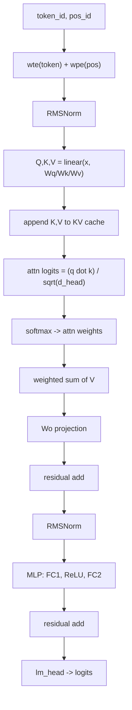

# microgpt 코드 리딩: ‘순수 파이썬’으로 구현한 GPT-2형 디코더 트랜스포머의 알고리즘 핵

> 이 글의 목표는 Andrej Karpathy의 *microgpt*가 보여주는 “훈련(training) + 추론(inference) GPT”의 **최소 알고리즘 구성요소**를, 트랜스포머(Transformer) 블록 관점에서 **개념 ↔ 수식 ↔ 코드**로 정규화해 연결하는 것이다.  
> 분석 대상: 사용자가 제공한 microgpt 단일 파일 스크립트(부록: 라인 번호 L001-L200).  
> 문체: 논문 리뷰/강의 노트 스타일(불필요한 수사 최소화).

---

## 0. 한 문장 요약: “이 코드에서 트랜스포머는 어디인가?”

이 코드에서 **트랜스포머(정확히는 GPT-2 계열 *디코더-only Transformer*)**는 `gpt()` 함수 내부의

- `for li in range(n_layer):` 루프(부록 L114-L142)  
  - (1) **Multi-Head Self-Attention 서브레이어** + residual  
  - (2) **MLP(FFN) 서브레이어** + residual  

로 구현된다. 이는 전형적인 GPT-계열 블록(Attention ↔ MLP가 residual stream 위에 교대로 얹히는 구조)과 동형이다.

---

## 1. microgpt의 위치: ‘알고리즘’과 ‘효율’을 분리하는 최소 구현

Karpathy는 microgpt를 “의존성 없는 순수 파이썬 단일 파일로 GPT를 학습/추론까지 수행”하는 프로젝트로 소개하며, 그 안에 **데이터셋/토크나이저/오토그라드/Transformer(GPT-2형)/Adam/훈련 루프/추론 루프**가 모두 포함된다고 정리한다 (Karpathy, 2026).  
또한 microgpt는 KV cache를 훈련 중에도 명시적으로 다루며(토큰을 한 step씩 처리하기 때문), cache가 그래프에서 분리(detach)되지 않아 **역전파가 KV cache를 통과**한다는 점도 언급한다 (Karpathy, 2026).

---

## 2. 코드 전체 지도: 섹션별 역할과 라인 범위

Medium 글에서는 “어디를 보고 있는지”가 이해 속도를 결정한다. 먼저 전체 구조를 고정한다.

| 구간 | 라인 | 하는 일 | 핵심 산출물 |
|---|---:|---|---|
| 데이터 로드 | L014-L021 | `docs: list[str]` 구성 | 문서 스트림 |
| 토크나이저 | L023-L027 | 문자 집합 + BOS 구성 | `vocab_size`, `BOS` |
| 오토그라드 | L029-L076 | `Value` 스칼라 자동미분 엔진 | `.backward()`로 모든 grad 계산 |
| 파라미터 초기화 | L078-L094 | 임베딩/어텐션/MLP/LM head 가중치 | `state_dict`, `params` |
| 모델 함수 | L094-L144 | `linear`, `softmax`, `rmsnorm`, `gpt()` | `logits` |
| 옵티마이저/훈련 | L147-L184 | Adam 업데이트 + 학습률 decay | loss 감소 |
| 추론/샘플링 | L186-L200 | temperature 샘플링 | 생성 문자열 |

---

## 3. 용어집 (Glossary)

강의 노트 스타일로 용어를 정규화한다.

| 용어 | 정의(엄밀) | microgpt에서의 위치 |
|---|---|---|
| 토큰(token) | 모델이 다루는 이산 심볼. 여기서는 **문자 단위**(a-z) + 특수 토큰 BOS | L023-L027 |
| BOS | Beginning Of Sequence. 문서 경계(시작/끝) 표지 토큰 | L025, L155, L191 |
| vocab | 가능한 토큰 집합의 크기 | L026 |
| 임베딩(embedding) | 토큰/위치를 실수 벡터로 매핑하는 lookup table | `wte`, `wpe` (L081) |
| residual stream | 각 레이어가 읽고 쓰는 “주” 표현 벡터(크기 `n_embd`) | `x` (L111~) |
| (Self-)Attention | 한 위치의 표현이 과거 위치들의 표현을 가중합으로 결합하는 통신 메커니즘 | L118-L135 |
| Head | Attention을 여러 하위 공간(head_dim)으로 분해한 병렬 통신 채널 | L124-L132 |
| KV cache | 과거 토큰들의 key/value를 저장해, 현재 query가 과거에 접근하도록 하는 캐시 | `keys`, `values` (L160-L168 / L190-L199) |
| Causal mask | 미래 토큰을 보지 못하도록 하는 제약(상삼각 마스크) | microgpt: “순차 처리 + cache”로 암묵 구현 |
| Logits | softmax 이전의 비정규화 점수 벡터(크기 vocab) | `logits` (L143) |
| Cross-entropy | 정답 토큰의 음의 로그확률을 최소화하는 언어모델 표준 목적함수 | L167-L169 |
| Backprop | 체인룰로 dLoss/dParam 계산 | L172 |
| Adam | 1차/2차 모멘트(EMA) 기반 적응형 옵티마이저 | L147-L182 |
| RMSNorm | RMS로만 정규화하는 LayerNorm 변형 | L103-L106 |

### 3.1 Autograd: `Value` 클래스가 보장하는 것(스칼라 자동미분)

`Value`는 한 개의 스칼라 실수(`.data`)를 담되, 그 값이 어떤 연산으로 만들어졌는지(부모 노드 `_children`)와 그 연산의 **국소 미분값(local gradient)** (`_local_grads`)을 함께 저장한다(부록 L029-L076).

핵심 불변식(invariant)은 다음 한 줄이다.

```text
상류 그래디언트(∂L/∂v)가 주어지면, 각 자식 c에 대해  ∂L/∂c += (∂v/∂c) * (∂L/∂v)
```

- `backward()`는 먼저 연산 그래프를 **위상정렬(topological order)** 로 정렬한 뒤(L053-L066), loss에서부터 역순으로 체인룰을 적용한다(L067-L071).
- `+=`가 필요한 이유는, 하나의 노드가 여러 경로로 loss에 기여할 수 있기 때문이다(다변수 체인룰의 “경로 합”).

microgpt의 `Value`가 지원하는 기본 연산은 add/mul/pow/log/exp/relu이며, 각 연산은 (forward 계산, local gradient 저장)으로 분해된다(부록 L039-L052).

### 3.2 파라미터 행렬(shape)과 파라미터 수(4192) 검증

microgpt는 텐서 라이브러리를 쓰지 않으므로, 모든 가중치는 **2중 리스트(행렬)** 로 저장된다. `matrix(nout, nin)`는 `(nout × nin)` 크기의 행렬을 생성한다(L080).

기본 하이퍼파라미터(`n_embd=16, n_head=4, n_layer=1, block_size=16, vocab_size=27`)에서 파라미터 수는 다음과 같이 합산된다(부록 L078-L094).

```text
wte:     vocab_size × n_embd   = 27×16 = 432
wpe:     block_size × n_embd   = 16×16 = 256
lm_head: vocab_size × n_embd   = 27×16 = 432
attn:    4개 행렬(Wq,Wk,Wv,Wo) = 4×(16×16)= 1024
mlp:     fc1(4d×d) + fc2(d×4d) = (64×16) + (16×64) = 1024 + 1024 = 2048
합계 = 432 + 256 + 432 + 1024 + 2048 = 4192
```

실행 시 `num params: 4192`가 출력되는 예시는 Karpathy 글에서도 제시된다 (Karpathy, 2026).

### 3.3 `softmax`의 수치 안정성 및 미분 관점 주석

`softmax`는 `exp(logit)`를 사용하므로, logit이 크면 overflow 위험이 있다. 그래서 `max(logits)`를 빼는 것이 관례적이다(L98-L101).

microgpt는 `max_val = max(val.data for val in logits)`로 **스칼라 상수**를 만들고, 각 logit에서 이를 빼서 `exp`를 계산한다(L98-L100).

- 상수를 빼는 것은 확률값을 바꾸지 않는다(softmax의 shift-invariance).
- `.data`로 max를 추출했기 때문에 max 연산 자체에 대한 미분은 추적하지 않지만, 여기서는 “모든 logit에 동일 상수를 더/빼는 변환”이므로 결과적 그래디언트에는 본질적 손실이 없다(동률 발생점의 비미분성은 실무 구현에서도 동일).

### 3.4 RMSNorm vs LayerNorm: 무엇이 제거되었는가

`rmsnorm(x)`는 `scale = 1/sqrt(mean(x^2)+eps)`로 벡터의 RMS를 1로 맞추고, `x * scale`만 수행한다(L103-L106).

- LayerNorm과 달리 **평균(mean) 제거가 없다**(centered normalization이 아님).
- 또한 통상 RMSNorm/LayerNorm에는 학습 가능한 affine(γ, β)이 포함되지만, microgpt는 이를 제거해 최소 형태로 둔다.

반면 GPT-2 논문은 LayerNorm을 각 sub-block 입력으로 이동(pre-norm)했다고 명시한다(Radford et al., 2019). 구현체(HF)도 `ln_1`, `ln_2` 형태로 이를 반영한다.


---

## 4. 그림 1: microgpt 전체 파이프라인 (Dataset → Tokenizer → Model → Loss → Backprop → Adam → Sampling)

아래 그림은 스크립트의 제어 흐름을 “한 장”으로 고정한다.


**캡션(Figure 1).** 문서 스트림(`docs`)을 문자 토큰으로 변환하고(BOS로 경계 처리), `gpt()`로 각 위치의 로짓을 산출해 cross-entropy를 계산한다. `Value.backward()`로 모든 파라미터의 기울기를 얻고, Adam으로 업데이트한 뒤, 훈련이 끝나면 temperature 샘플링으로 새 문자열을 생성한다.

---

## 5. 그림 2 + Table 1: Transformer block ↔ microgpt 코드 매핑

### 5.1 Transformer block의 표준 형태(디코더-only)

GPT 계열 블록은 다음을 반복한다.

- 입력: residual stream `x_t ∈ R^{n_embd}`
- (A) Self-Attention 서브레이어: 과거(0..t)로부터 정보 결합
- (B) MLP(FFN) 서브레이어: 위치별 비선형 변환
- 각 서브레이어는 residual add로 `x`에 누적(“residual stream” 유지)

### 5.2 microgpt에서의 위치


**캡션(Figure 2).** `gpt()` 내부의 한 레이어(`li`)는 (1) RMSNorm → QKV 투영 → scaled dot-product attention → WO 투영 → residual, (2) RMSNorm → FC1 → ReLU → FC2 → residual로 구성된다. 대응 라인은 Table 1에 요약한다.

### 5.3 Transformer block ↔ code mapping 표(Table 1)

| Transformer 개념 | microgpt 변수/연산 | 라인 |
|---|---|---:|
| Token embedding | `tok_emb = wte[token_id]` | L109 |
| Pos embedding | `pos_emb = wpe[pos_id]` | L110 |
| Embed 결합 | `x = tok_emb + pos_emb` | L111 |
| (Pre) Norm | `x = rmsnorm(x)` | L112 |
| Q/K/V 투영 | `q,k,v = linear(x, Wq/Wk/Wv)` | L118-L120 |
| KV cache 갱신 | `keys[li].append(k)`, `values[li].append(v)` | L121-L122 |
| Head 분해 | slicing `q_h, k_h, v_h` | L125-L128 |
| Score | `attn_logits = q·k / sqrt(d)` | L129 |
| Softmax | `attn_weights = softmax(attn_logits)` | L130 |
| Weighted sum | `head_out = Σ a_t v_t` | L131 |
| Head concat | `x_attn.extend(head_out)` | L132 |
| Output proj | `x = linear(x_attn, Wo)` | L133 |
| Residual add | `x = x + x_residual` | L134 |
| MLP up-proj | `x = linear(x, W1)` | L138 |
| Activation | `x = [xi.relu() for xi in x]` | L139 |
| MLP down-proj | `x = linear(x, W2)` | L140 |
| Residual add | `x = x + x_residual` | L141 |
| LM head | `logits = linear(x, lm_head)` | L143 |

### 5.4 보조 도표: ASCII / Mermaid

아래 도표는 Figure 2의 내용을 텍스트 형태로도 재현한 것이다(복사/편집 용이).

#### ASCII (block view)

```text
x_t = wte[token_id] + wpe[pos_id]            (L109-L111)
  |
  v
RMSNorm                                     (L112)
  |
  v
Self-Attention: Q,K,V projections            (L118-L120)
  |            append to KV cache            (L121-L122)
  |            scaled dot-product + softmax  (L129-L131)
  v
WO projection + Residual add                 (L133-L134)
  |
  v
RMSNorm                                     (L137)
  |
  v
MLP: FC1 -> ReLU -> FC2 + Residual add       (L138-L141)
  |
  v
lm_head -> logits                            (L143)
```

#### Mermaid (flow view)




---

## 6. Attention을 “정확히” 읽기: 왜 이것이 트랜스포머의 핵심인가

Karpathy의 서술(“Attention=communication, MLP=computation”)은 현대 트랜스포머 해석에서 널리 쓰이는 관점이다 (Karpathy, 2026).

### 6.1 수식(표준)

한 head에 대해, 시간 t에서:

- `q_t = x_t W_Q`, `k_i = x_i W_K`, `v_i = x_i W_V`
- `α_{t,i} = softmax_i( (q_t · k_i) / sqrt(d_head) )`
- `h_t = Σ_i α_{t,i} v_i`
- multi-head concat 후 `W_O`로 투영

microgpt는 이를 “리스트 + 스칼라 Value” 연산으로 그대로 전개한다(L124-L133).

### 6.2 microgpt 구현의 주목점: “마스킹이 없는 이유”

표준 구현은 `T×T` 어텐션 행렬에서 미래 위치를 삼각 마스크로 가린다. 반면 microgpt는 **아예 미래 토큰을 계산하지 않는 제어 흐름**(pos_id를 0→t로 순차 진행)으로 동일한 인과성 제약을 구현한다. 이 차이는 §7에서 정규화한다.

---

## 7. 그림 3: Causal Masking ↔ KV Cache(순차 처리)의 동치

표준 GPT-2는 병렬 처리를 위해 `(batch, T, d)` 텐서로 전체 시퀀스를 한 번에 넣고, `(T×T)` 어텐션 점수에 **causal mask**를 적용한다. 대표 구현(Hugging Face)에서도 causal mask가 버퍼로 유지되며, `torch.where`로 마스킹되는 형태가 확인된다 (Transformers GPT-2 구현 코드).

반면 microgpt는:

- t번째 토큰을 계산할 때 `keys[li]`와 `values[li]`에 **0..t의 항만 존재**하도록 유지하고(L121-L122),
- 그 리스트 길이만큼만 점수(`attn_logits`)를 계산한다(L129).

즉, “가릴 필요가 있는 미래 항” 자체가 생성되지 않는다.


**캡션(Figure 3).** 왼쪽은 전형적 triangular causal mask, 오른쪽은 microgpt의 KV cache가 1 step마다 성장하는 방식이다. 두 방식은 *미래 토큰 접근 금지*라는 제약을 서로 다른 실행 전략으로 구현한다.

---

## 8. 목적함수(손실): 왜 `-log p(target)`가 언어모델 학습의 표준인가

각 위치 `pos_id`에서 모델은 다음 토큰 분포 `p(·|context)`를 출력한다.

- microgpt: `probs = softmax(logits)` (L166)
- 손실: `loss_t = -log probs[target_id]` (L167)
- 문서 평균: `loss = (1/n) * Σ_t loss_t` (L169)

이는 표준적인 토큰 단위 cross-entropy(= negative log-likelihood)의 형태다.

참고로 vocab이 27이면, 무작위 균등분포의 기대 손실은 `-log(1/27) = log(27) ≈ 3.296`이며, Karpathy의 실행 예시에서도 초반 loss가 ~3.3에서 시작함이 제시된다 (Karpathy, 2026).

---

## 9. Adam 업데이트: 수식과 코드의 1:1 대응

microgpt는 Adam을 다음과 같이 구현한다(L147-L182):

- `m_t = β1 m_{t-1} + (1-β1) g_t`
- `v_t = β2 v_{t-1} + (1-β2) g_t^2`
- bias correction: `m̂_t = m_t/(1-β1^t)`, `v̂_t = v_t/(1-β2^t)`
- update: `θ ← θ - lr * m̂_t/(sqrt(v̂_t)+eps)`

또한 학습률을 step에 따라 선형 감소시킨다(L175).

---

## 10. 추론: temperature 샘플링은 무엇을 조절하는가

훈련이 끝난 뒤에는 파라미터를 고정하고, BOS로 시작해 다음 토큰을 반복 샘플링한다(L189-L200).

- logits 스케일: `logits / temperature` (L195)
- `temperature ↓` → 분포가 날카로워짐(보수적)
- `temperature ↑` → 분포가 평평해짐(다양성 증가)

---

## 11. microgpt vs “표준 GPT-2 구현”: 요구 항목 5종 비교(정규화/activation/positional/weight tying/masking)

아래 비교는 (1) GPT-2 원 논문 기술(Radford et al., 2019), (2) 대표 공개 구현(예: Hugging Face Transformers)의 문서/코드 관찰을 근거로 정리한다.

### Table 2. 항목별 비교 요약

| 항목 | microgpt(본 코드) | 표준 GPT-2(논문/대표 구현) | 구현·학습 관점의 의미 |
|---|---|---|---|
| Normalization | `rmsnorm(x)`이며 **학습 가능한 affine(gain/bias) 없음**(L103-L106) + 블록 전/서브레이어 전 RMSNorm | GPT-2는 **LayerNorm을 각 sub-block 입력으로 이동(pre-norm)**했다고 논문에서 명시(Radford et al., 2019). HF 구현도 `ln_1`, `ln_2`가 서브레이어 입력에 적용됨 | LN vs RMSNorm, affine 유무는 학습역학(스케일/편향 적응)에 영향을 준다 |
| Activation | ReLU (L139) | GPT-2 계열 구현에서는 보통 GELU 계열을 사용. HF 문서에서 GPT2Config 기본은 `"gelu_new"` | 활성화 형태 차이가 성능/안정성에 영향을 줄 수 있다 |
| Positional encoding | 절대 위치 임베딩 `wpe[pos_id]`를 더함(L110-L111) | GPT-2도 절대 위치 임베딩을 사용(Transformers GPT-2 구현 코드/문서) | microgpt는 “교과서적” 절대 위치 방식 |
| Weight tying | `wte`와 `lm_head`가 분리(별도 행렬) (L081, L143) | GPT-2 LM head는 입력 임베딩과 가중치를 공유(tie)하는 것이 일반적이며, HF 문서에서도 tied weight를 명시 | 파라미터 효율/일반화에 영향을 주는 표준 기법 |
| Masking 처리 | 명시적 mask 없음. **순차 처리 + KV cache**로 인과성 구현 | 표준 구현은 causal attention에서 triangular mask를 적용(Transformers GPT-2 구현 코드) | “동일한 제약”을 다른 실행 전략으로 구현(§7) |

---

## 12. 표준 GPT-2 구현(대표적 PyTorch/HF 스타일)과의 코드 스케치 비교

요구사항에 따라, “표준 구현에서 어떻게 보이는가”를 5~10줄 수준의 **재구성(pseudocode)** 로 제시한다. (아래 코드는 HF 소스의 구조를 모사하되, 특정 구현의 긴 코드를 그대로 복제하지 않는다.)

### 12.1 Pre-LN 블록 구조(ln_1/ln_2)

```python
# (재구성) GPT-2 block의 전형적 형태: pre-LN + residual
residual = x
x = ln_1(x)
x = attn(x, causal_mask=True)      # self-attention
x = x + residual

residual = x
x = ln_2(x)
x = mlp(x, act="gelu_new")         # FFN
x = x + residual
```

### 12.2 Causal mask 적용(행렬 관점)

```python
# (재구성) attention score에 triangular causal mask 적용
scores = (q @ k.transpose(-2, -1)) / sqrt(d_head)
scores = where(causal_mask, scores, -inf)
probs  = softmax(scores)
out    = probs @ v
```

### 12.3 Weight tying(입력 임베딩 ↔ LM head)

```python
# (재구성) 입력 임베딩과 출력 헤드 가중치 공유
wte = nn.Embedding(vocab, d_model)
lm_head = nn.Linear(d_model, vocab, bias=False)
lm_head.weight = wte.weight
```

---

## 13. 정확성 검증(팩트 체크) 로그

이 글은 다음을 교차 확인했다.

- microgpt의 구성요소/설계 의도/훈련-추론 흐름: Karpathy 블로그 글과 일치하는지 점검 (Karpathy, 2026)
- GPT-2의 pre-norm 등 구조적 기술: GPT-2 원 논문 2.3절(Model) 확인 (Radford et al., 2019)
- causal mask/activation/weight tying 등 구현 관례: Hugging Face Transformers의 GPT-2 코드/문서 확인 (Transformers docs & source)

---

## 14. 참고자료(References)

Medium 게시 시 아래 URL을 링크로 변환하면 된다.

```text
[1] Andrej Karpathy (2026). "microgpt". Feb 12, 2026.
    https://karpathy.github.io/2026/02/12/microgpt/

[2] Andrej Karpathy. microgpt source code (Gist).
    https://gist.github.com/karpathy/8627fe009c40f57531cb18360106ce95

[3] Andrej Karpathy. microgpt single-page.
    https://karpathy.ai/microgpt.html

[4] Alec Radford et al. (2019). "Language Models are Unsupervised Multitask Learners" (GPT-2 paper).
    https://cdn.openai.com/better-language-models/language_models_are_unsupervised_multitask_learners.pdf

[5] Hugging Face Transformers. GPT-2 source & documentation.
    https://huggingface.co/transformers/v4.9.2/_modules/transformers/models/gpt2/modeling_gpt2.html
    https://huggingface.co/docs/transformers/en/model_doc/gpt2
```
